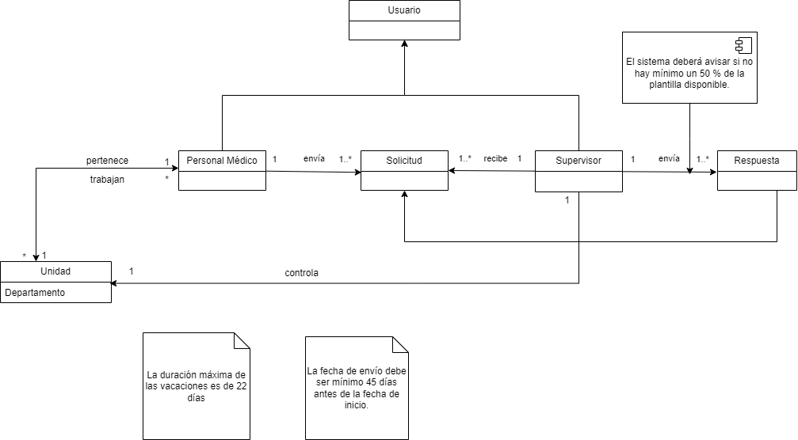

# CGIS - Proyecto evaluación continua
En este Readme.md deberá describir:
- Título
- Integrantes
- Dominio
- Usuarios del sistema
- Requisitos de información
- Requisitos funcionales
- Modelado conceptual en UML.
- Manual de usuario con capturas.

GESTIÓN VACACIONES PERSONAL MÉDICO.

Alejandro Márquez González y Francisco Javier Franco Ruiz.

- DOMINIO.
El gerente de recursos humanos de un hospital quiere realizar una aplicación para gestionar las vacaciones del personal sanitario. El funcionamiento sería el siguiente: Un profesional sanitario envía una solicitud de vacaciones, la cual llega al responsable de su unidad y esté aceptara o denegara dicha solicitud.

El personal médico se caracterizará por: Nombre, Edad, Profesion, Especialidad, Unidad y años trabajados.
Las solicitudes se enviarán por orden descendente de años trabajados.Las solicitudes podrán ser aceptadas o denegadas. Deberán ser enviadas mínimo 45 días antes de la fecha inicio de la solicitud. La solicitud tendrá una fecha de inicio y una fecha fin.

La respuesta debe ser enviada minimo 30 días antes de la fecha inicio de la solicitud. Será aceptada si:
    - En una unidad, mínimo el 50% de la plantilla está disponible.
    - Un profesional, puede pedir como máximo 22 días de vacaciones en un mismo año.
    - Se respeta el orden de preferencia antes comentado.

Las unidades del hospital están compuestos por personal sanitario(plantilla) y supervisado por un gerente, cada unidad corresponde a un departamento(Psicología, Otorrinolaringología, Maternidad...)

- USUARIOS DEL SISTEMA
Personal médico: Podrán utilizar la aplicación tanto para ver las fechas disponibles en las que puedan solicitar sus vacaciones como para mandar dicha solicitud a su supervisor y/o gerente.

Gerentes y supervisores: Podrán utilizar la aplicación para aceptar o denegar las solicitudes de la unidad   que controlen.

- Requisitos de información: 
    El sistema deberá permitir disponer la siguiente información sobre el personal sanitario:
        - Nombre
        - Edad
        - Profesion
        - Años de antiguedad

    El sistema deberá permitir disponer la siguiente información sobre la solicitud:
        - Fecha inicio
        - Fecha final
        - Estado

    El sistema deberá permitir disponer la siguiente información sobre el supervisor:
        - Nombre
        - Unidad

    El sistema deberá permitir disponer la siguiente información sobre la respuesta:
        - Aceptado o denegado.
        - Fecha.
        -Comentario.

    El sistema deberá permitir disponer la siguiente información sobre la unidad:
        - Departamento de la unidad
        - Número profesionales en plantilla de cada tipo
        - Supervisor

- Requisitos funcionales

- Reglas de negocio.
    El sistema debe avisar si el solicitante ya ha tenido unas vacaciones ese mismo año
    El sistema deberá avisar si la solicitud de vacaciones es anterior a la fecha actual
    La solicitud de vacaciones solo puede ser aceptada si, durante el periodo solicitado, al menos el 50% de la plantilla de la unidad está disponible.
    El sistema deberá avisar si la respuesta a la solicitud no se envía con 30 días de antelación
    El sistema deberá avisar si la solicitud no se envía con 45 días de antelación.
    El sistema deberá avisar si los profesionales sanitarios no han tomado sus vacaciones 
    El sistema deberá avisar si hay cualquier cambio en el periodo de vacaciones, enviando así notificaciones
    El sistema deberá avisar si el gerente de la unidad acepta o rechaza las peticiones de los periodos de vacaciones

    ;

    PROYECTO GESTIÓN DE VACACIONES PARA EL PERSONAL SANITARIO.
DOMINIO DEL PROBLEMA.
Se ha desarrollado una aplicación web en Laravel destinada a administrar el sistema de vacaciones laborales del personal sanitario de la Junta de Andalucía. Esto incluye la gestión de solicitudes de vacaciones y la supervisión de las mismas. El objetivo se basa en mejorar la organización de calendarios laborales y posibles integraciones con sistemas adicionales de recursos humanos como la gestión de plantillas en distintas unidades según la especialidad del profesional.

USUARIOS DEL SISTEMA.
El sistema estaría diseñado para ser utilizado por todo el personal médico, así como por los supervisores de las unidades dentro del ámbito de la Junta de Andalucía.
REQUISITOS DE INFORMACIÓN.
El sistema deberá mostrar la siguiente información:
1. Personal Médico:
- Edad: La edad del personal médico.
- Fecha de Contratación: La fecha en la que el personal médico fue contratado.
- DNI: El documento nacional de identidad del personal médico.
- Especialidad: La especialidad en la que está capacitado el personal médico.
2. Supervisor:
- Nombre: El nombre del supervisor.
- Unidad: La unidad a la que está asignado el supervisor.
- DNI: El documento nacional de identidad del supervisor.
3. Unidad:
- Departamento: El departamento al que pertenece la unidad.
- Número de Profesionales: La cantidad de profesionales asignados a la unidad.
4. Solicitud:
- Estado: El estado actual de la solicitud (por ejemplo, pendiente, aprobada, rechazada).
- Fecha de Inicio: La fecha en la que se inició la solicitud.
- Fecha Final: La fecha en la que se finalizó o se espera finalizar la solicitud.
5. Respuesta:
- Estado: El estado de la respuesta a la solicitud (por ejemplo, respondida, no
respondida).
- Fecha: La fecha en la que se proporcionó la respuesta.
- Comentario: Los comentarios adicionales proporcionados en la respuesta.
6. Especialidad:
- Nombre: El nombre de la especialidad médica.

 REQUISITOS FUNCIONALES.
 
- Como administrador quiero crear, editar, mostrar y borrar al personal médico.
- Como administrador quiero crear, editar, mostrar y borrar especialidades.
- Como personal médico quiero poder mostrar y editar tan solo mi propia información.
- Como personal médico quiero poder ver las especialidades.
- Como administrador quiero poder filtrar a los profesionales según su especialidad.

OBJETIVO Y SOLUCIÓN DEL PROBLEMA PLANTEADO.

El funcionamiento sería el siguiente: Un profesional sanitario envía una solicitud de vacaciones, la cual llega al responsable de su unidad y esté aceptará o denegará dicha solicitud.
El desarrollo de esta aplicación web busca mejorar la gestión del personal médico y optimizar la supervisión mediante una plataforma centralizada y accesible. Los objetivos incluyen facilitar el registro y actualización de información personal y profesional, gestionar y monitorear unidades y personal, y manejar eficientemente las solicitudes y respuestas. Se pretende proporcionar una visualización clara de las especialidades médicas y asegurar la seguridad y protección de datos sensibles. La aplicación también busca aumentar la eficiencia administrativa, automatizando procesos para minimizar errores.

EVOLUCIÓN DEL PROYECTO.

- PRIMERA ENTREGA.
Se detalló el planteamiento del problema así como el dominio, usuarios y requisitos.
- SEGUNDA ENTREGA.
Se logró implementar con éxito el CRUD completo de la entidad "Especialidad", permitiendo la creación, lectura, actualización y eliminación de registros de manera eficiente y segura. Además, se integró un sistema de autenticación completo que garantiza que solo usuarios autorizados puedan acceder y manipular los datos. Esta funcionalidad asegura que el manejo de la información del personal médico sea confiable, preciso y accesible solo para aquellos con los permisos adecuados, mejorando significativamente la gestión y seguridad de la plataforma.
- TERCERA ENTREGA.
Se logró implementar con éxito el CRUD completo de la entidad "Personal Médico", permitiendo la creación, lectura, actualización y eliminación de registros de manera eficiente. Además, se implementó un robusto control de la sesión, asegurando que solo usuarios autenticados puedan acceder a las funcionalidades de la plataforma. Se añadieron Policies para gestionar los permisos y asegurar que cada usuario solo pueda realizar acciones permitidas según su rol. Finalmente, se implementó una validación completa de los datos, garantizando la integridad y precisión de la información ingresada en el sistema.
   
 MODELADO CONCEPTUAL EN UML.
 MANUAL DE USO.
- PANTALLA DE INICIO.
  - REGISTRO
 
 
 - ACCEDER
  - DASHBOARD
  - PERSONAL MÉDICO.
 
  Realizado por: Alejandro Márquez González y Francisco Javier Franco Ruiz.